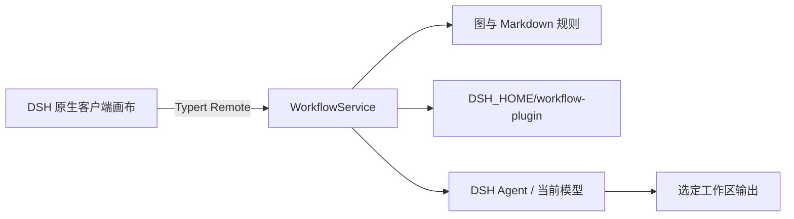

# 架构与状态

## 进程边界

Host 通过 DSH Cordis 插件提供存储、校验、文件访问、计划生成和 Agent 执行。浏览器页面只调用 Typert Remote，不直接改写运行状态。`src/host/remote-contract.ts` 是 Host/Client 生成契约的源文件。

## 节点与连线

- Task 保存执行要求、验收条件、任务顺序、预期文件、预期文本和自动/人工验收模式。
- File 保存工作区内源文件路径；Prompt 保存补充文本与启用开关。
- `dependency` 只允许 Task → Task，参与有向无环图检查和拓扑排序。
- `context` 只允许 File/Prompt → Task，仅决定输入，不参与调度。
- 就绪任务按 `order` 再按稳定 ID 排序；一次只派发一个任务。

## 执行、验收和停止

开始时校验图、路径和文件，保存固定工作流及上下文快照，文件使用 UTF-8 和 SHA-256。Agent 每个任务使用独立 session ID，工作目录绑定输出目录。Host 监听 DSH session event，保存最终回复和工具名称。任务的自动验收只读检查相对输出路径是否存在，或其 UTF-8 内容是否包含明确文本；缺结果、文件缺失或内容不匹配均失败。人工任务到边界后进入暂停状态，用户通过后才解锁后继，驳回则失败。整条工作流完成后仍要求用户人工核对未配置的质量和测试条件。

暂停请求先进入 `pausing`，当前任务结束后才变为 `paused`。停止调用 Agent cancel 并等待结束。重复开始通过 requestId 返回已有 Run。Run 使用跨进程文件锁和原子 JSON 写入；Host 重启时把活动 Run 标记 `interrupted`，不自动重放。

## 修订、快照和存储

保存使用 `expectedRevision` 做并发冲突检测，成功保存单调增加 revision。每个 Run 保留当时的完整工作流、文件内容、来源路径、哈希、任务尝试、产物检查和递增事件。文件源变化不会改变已有运行快照。存储使用 `DSH_HOME/workflow-plugin/state.json`，当前 schemaVersion 为 2；读取已知版本 1 时补齐工作区、验收字段和 revision 再迁移写回。不认识的版本或格式错误时拒绝覆盖。

输出路径和附件路径需在已选工作区内；存在的 symlink/junction 通过 realpath 解析，尚未创建的路径从最近现存父目录解析后再判定。路径检查不能消除有权限进程同时替换目录链接造成的所有文件系统竞态，因此测试应使用隔离工作区。

## 首版限制

单个工作流最多 30 个任务和 20 个上下文节点；每个 UTF-8 文本文件最多 2 MiB；一次计划/运行上下文最多 4 MiB；本地 JSON 数据最多 64 MiB；历史保留最近 200 个 Run。当前没有用户自定义 shell 命令验收，也没有独立资产仓库；运行启动时读取并快照工作区文件。详见验收报告。
